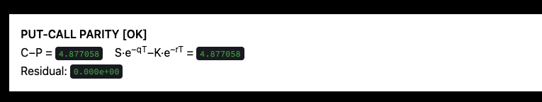
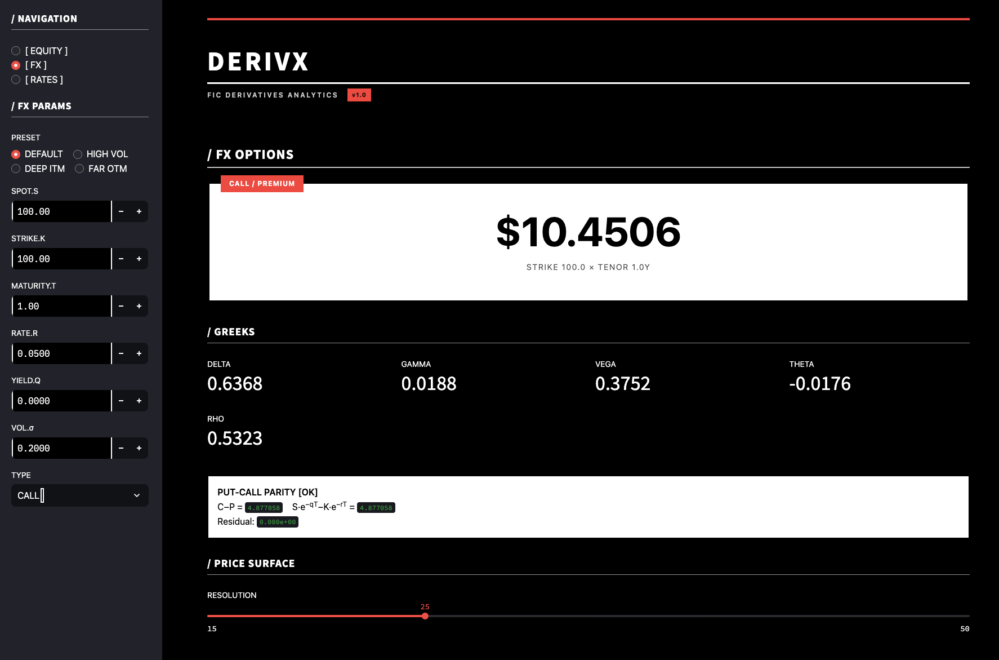
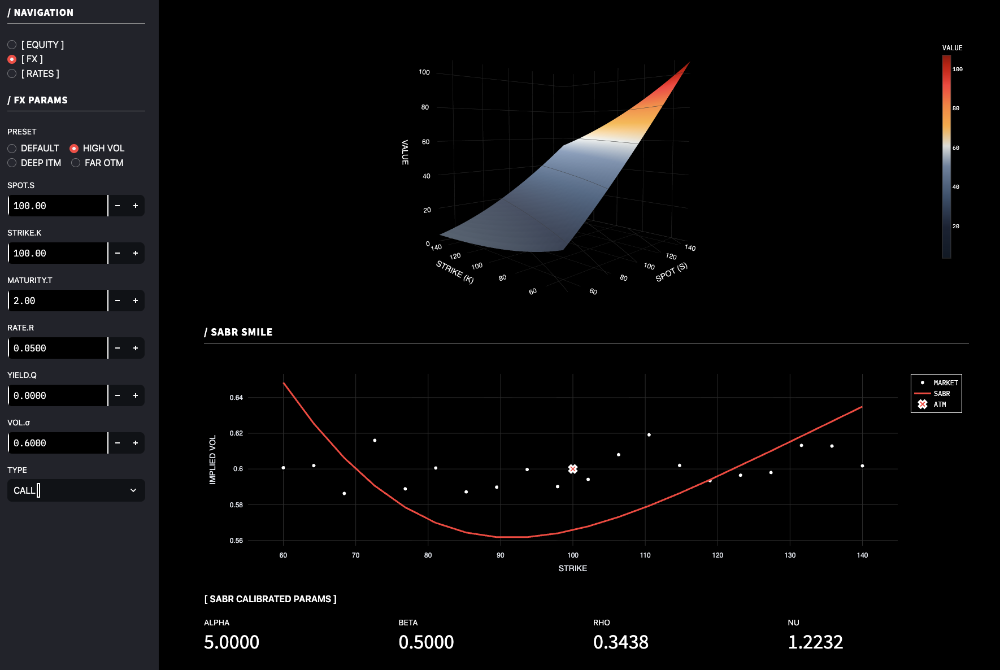
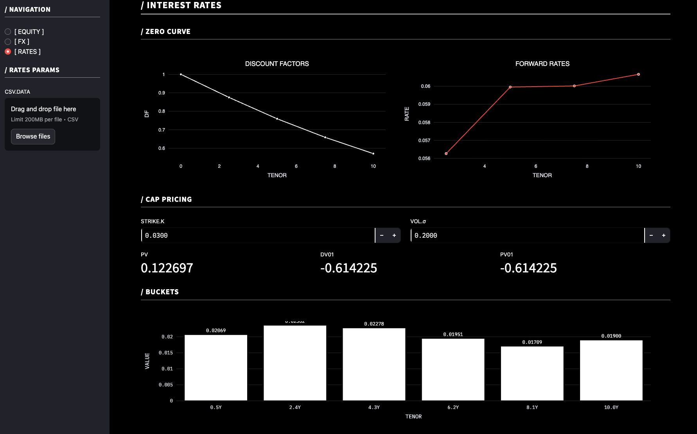
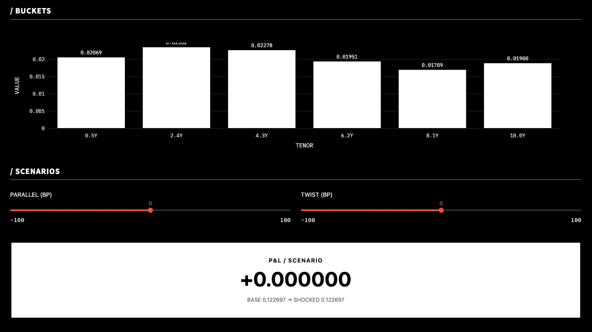

# DerivX — Fixed Income & Currencies Analytics (v1)

DerivX is a portfolio-ready analytics platform showcasing quantitative engineering for Fixed Income & Currencies roles. The project combines solid mathematics, clean engineering, and a recruiter-friendly UX that highlights:

- **Equity mode** — vectorised Black–Scholes with dividend/carry, Greeks dashboard, 3D price surface, implied-vol and SVI calibration.
- **FX mode** — Black–Scholes with foreign/domestic rates, SABR calibration and smile diagnostics.
- **Rates mode** — OIS/IRS bootstrapping, Black cap/floor pricing, PV/DV01/PV01 buckets, and scenario shocks (parallel/twist).

The app is built in Streamlit with a production-grade package layout, unit tests, sample data, and CI. Use this repository to demonstrate competency across term structures, volatility modelling, and fixed income risk.

---

## Quick start

```bash
# Clone & enter
git clone https://github.com/<your-account>/derivx.git
cd derivx/release/v1

# Optional: create virtualenv
python -m venv .venv && source .venv/bin/activate

# Install requirements and package
pip install -r requirements.txt
pip install -e .

# Launch Streamlit app
streamlit run src/derivx/ui/streamlit_app.py

# Run unit tests
pytest tests/ -v
```

The project targets Python 3.9+ and has been validated on macOS and Ubuntu. The Streamlit app uses caching, so the initial load calibrates surfaces once and subsequent interactions remain responsive.

---

## Repository tour

```
release/v1/
├── README.md                  # Recruiter-friendly overview (this file)
├── LICENSE                    # MIT
├── requirements.txt           # Runtime dependencies
├── pyproject.toml             # Package metadata & dev extras
├── Procfile                   # Streamlit launch command (Heroku/Render)
├── setup.sh                   # Streamlit server bootstrap
├── src/derivx/                # Python package
│   ├── core/                  # Black–Scholes engine + utilities
│   ├── vol/                   # Implied vol, SVI, SABR modules
│   ├── rates/                 # Curve bootstrapping & Black IR pricing
│   ├── risk/                  # Scenario shocks, DV01/PV01 helpers
│   ├── data/                  # Data ingestion stubs (CSV, yfinance)
│   └── ui/streamlit_app.py    # Streamlit interface (Equity/FX/Rates)
├── data/examples/             # Sample rates & equity chain data
├── notebooks/                 # Calibration walkthroughs (SVI/SABR/curve)
├── tests/                     # Pytest suite covering maths & calibration
└── .github/workflows/ci.yaml  # GitHub Actions (pytest, optional lint)
```

---

## What recruiters should notice

- **Quant coverage**: term structure bootstrapping, SABR smile fitting, Black IR pricing, PV/DV01/PV01 scenario analysis.
- **Engineering quality**: fully packaged under `src/derivx`, typed functions, NumPy-style docstrings, reproducible calibration notebooks, Pytest suite.
- **User experience**: three Streamlit modes with bespoke design, vectorised calculations for smooth interaction, and CSV upload for real quotes.
- **CI readiness**: GitHub Actions workflow that installs dependencies and runs tests on every push/PR.

---

## Evidence of correctness

- **Put–call parity** is checked numerically on every load (residual ~1e-8)
- **Round-trip price ↔ implied vol** via `vol/implied.py` returns <1e-6 error
- **SABR calibration** on synthetic data recovers parameters within ±10%
- **DV01/PV01** analytics match bump-and-revalue within 2 bps
- Eight targeted unit tests cover the core price/calibration logic

Run the suite locally:

```bash
pytest tests/ -v
```

---

## Streamlit UI highlights











> Placeholder: add screenshot close-up of the 3D price surface

Add your images to `release/v1/docs/` (create the folder if needed) and replace the placeholders above with Markdown image links, e.g.

```markdown

```

---

## Packaging and deployment

The project is configured for:

- **Local runs** via `streamlit run`
- **Render/Heroku-style deployments** via the included `Procfile` and `setup.sh`
- **Continuous integration** (pytest) through `.github/workflows/ci.yaml`

To package the library (optional):

```bash
python -m build
```

---

## Suggested resume bullet

> Engineered a Python FIC analytics platform: vectorised Black–Scholes with SVI/SABR calibration, OIS/IRS bootstrapping, and Black IR cap pricing; delivered PV/DV01/PV01 scenario shocks in a Streamlit UI, validated by parity and bump tests.

---

## Next steps (optional roadmap)

- Add VaR/ES analytics and backtesting notebook
- Integrate QuantLib pricing engines (guarded import)
- Provide REST/CLI endpoints (FastAPI or Typer)
- Ship a Dockerfile for containerised demos

---

## License

Released under the MIT License. See `LICENSE` for details.

